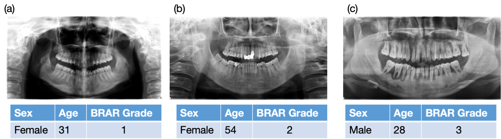
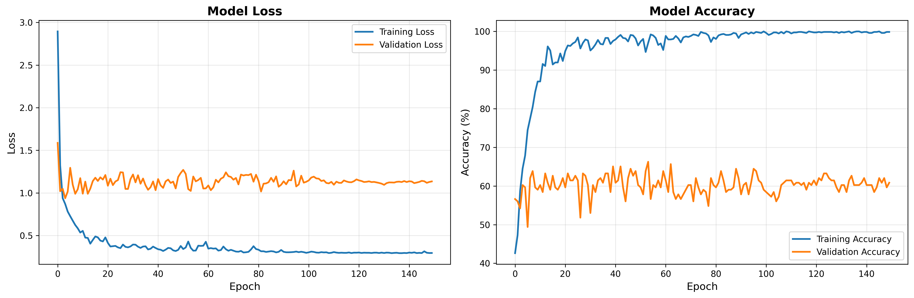

# BRAR-anchored Multimodal Dataset for Periodontal Bone Resorption Grading

[](https://creativecommons.org/licenses/by/4.0/)
[](https://doi.org/10.6084/m9.figshare.30155974)

This repository supports the **BRAR-anchored multimodal dataset** of panoramic radiographs for periodontal bone resorption grading, developed for AI-driven periodontal research. The dataset includes **1,104 fully anonymized panoramic radiographs**, demographic metadata, tooth-level annotations, and a novel **Bone Resorption Age Ratio (BRAR)** for standardized severity assessment.

> 📌 **Dataset DOI**: [10.6084/m9.figshare.30155974](https://doi.org/10.6084/m9.figshare.30155974)  
> 🌐 **Figshare (Public)**: [https://figshare.com/s/cc2db8648788c7aa175c](https://figshare.com/s/cc2db8648788c7aa175c)  
> 📄 **Codebook**: `BRAR_codebook_v1.0.xlsx` (available on Figshare)  
> 📝 **Annotation Protocol**: `BRAR_annotation_protocol_v1.0.pdf` (available on Figshare)




## 📁 Dataset Overview

The dataset integrates three modalities:

1. **Panoramic Radiographs**: High-resolution JPG images (anonymized, no facial features).
2. **Demographic Data**: Age, sex, etc.
3. **Clinical Annotations**:
   - Tooth-level: missing teeth, implants, residual roots, functional opposing pairs
   - Patient-level: BRAR score and severity grade (1–3)

All patient identifiers are randomized UUIDs; no personally identifiable information is retained.

---

## 🗂️ Dataset Structure (on Figshare)

BRAR-dataset/ 

├── images/ # Anonymized panoramic radiographs (.jpg) 

├── annotations/ │

├── demographics.csv # Age, sex │ 

├── tooth_level_labels.csv # Missing teeth, implants, residual roots, functional pairs

 │ └── brar_grades.csv # Patient-level BRAR and severity grade 

├── BRAR_codebook_v1.0.xlsx # Machine-readable variable definitions 

└── BRAR_annotation_protocol_v1.0.pdf # Full grading and landmark protocol

All identifiers are randomized UUIDs; no personally identifiable information is retained.

---

---

## 🔁 Reproducibility

This repository provides code to reproduce:
- Data preprocessing and anonymization
- Label parsing
- Baseline BRAR severity classification model

### 🧰 Dependencies

```txt
Python >= 3.8
torch >= 2.0
timm
pandas
numpy
scikit-learn
Pillow (PIL)
matplotlib
seaborn
```

## 🧪 Reproducibility

This repository provides code to reproduce data preprocessing, label parsing, and baseline classification models.

### 🔧 Dependencies
- Python ≥ 3.8
- PyTorch ≥ 2.0
- timm
- pandas, numpy, scikit-learn, PIL, matplotlib, seaborn

Install via:
```bash
pip install torch torchvision timm pandas numpy scikit-learn pillow matplotlib seaborn
```

### 📂 Repository Structure

|                                 |                                                              |
| ------------------------------- | ------------------------------------------------------------ |
| `datapreprocess.py`             | (Template) Data anonymization and CSV generation pipeline    |
| `train.py`                      | Main training script for 3-class BRAR severity classifier    |
| `train01.py`                    | Alternative training configuration (e.g., different backbone) |
| `*.png`                         | Training curves (`modern_training_curves.png`) and analysis results (`detailed_analysis_results.png`,`data.png`) |
| `optimized_bone_classifier.pth` | Pretrained ViT-based classifier (for inference)              |

**#** **BRAR-anchored Multimodal Dataset for Periodontal Bone Resorption Grading**

### ▶️ Train the Baseline Model

```python
python train.py \
  --data_root /path/to/figshare/images \
  --label_csv /path/to/annotations/brar_grades.csv \
  --output_dir ./results
```



### 🧪 Inference Example

```python
from PIL import Image
import torch
model = torch.load('optimized_bone_classifier.pth')
img = Image.open('sample.jpg').convert('RGB')
# apply same transforms as in train.py
output = model(img_tensor)
predicted_grade = torch.argmax(output, dim=1)
```


## 📚 Citation

If you use this dataset or code in your research, please cite:

> Li, Z. et al. BRAR-anchored multimodal dataset of panoramic radiographs for periodontal bone resorption grading. *Sci Data* (2025).
> Dataset DOI: [10.6084/m9.figshare.30155974 ](https://doi.org/10.6084/m9.figshare.30155974)

## 📜 Licenses

- **Dataset**: [Creative Commons Attribution 4.0 International (CC-BY 4.0)](https://creativecommons.org/licenses/by/4.0/)
- **Code**: MIT License (unless otherwise specified)

> ✅ The dataset is fully anonymized and shared under CC-BY 4.0 with ethics approval covering open reuse. 

## 📬 Contact

For questions about the dataset or collaboration:
**Zhi Li** – [zhi.li@hdu.edu.cn](mailto:zhi.li@hdu.edu.cn)

